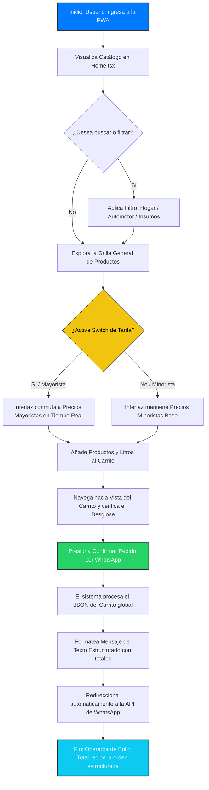
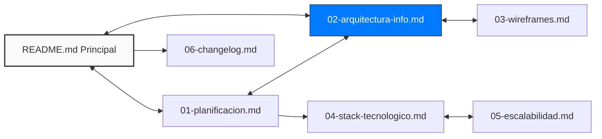

# 📂 Arquitectura de la Información y Flujos de Usuario

Este documento describe la estructura jerárquica de las pantallas de la PWA de **Brillo Total** y el recorrido lógico que realiza un usuario para completar el proceso clave de preventa digital.

---

## 🗺️ 1. Mapa del Sitio (Sitemap)

La aplicación está diseñada bajo el modelo de **SPA (Single Page Application)**, utilizando renderizado condicional y rutas optimizadas para dispositivos móviles. La estructura de navegación e información se organiza de la siguiente manera:

```text
Plataforma Digital "Brillo Total" (Raíz / App.tsx)
│
├── 🔹 Header (<header> - Navegación Global)
│   └── 🔄 Switch de Tarifa Global (Alternador Minorista / Mayorista en Tiempo Real)
│
├── 🖥️ Vistas Principales (<main> - Inyección Dinámica)
│   ├── 🏠 Home.tsx (Catálogo Público General)
│   │   ├── 🐕 Banner Informativo (Identidad Perro Salchicha)
│   │   ├── 🔍 Barra de Búsqueda y Filtros por Categoría
│   │   │   ├── 🧼 Línea Hogar
│   │   │   ├── 🚗 Línea Automotor
│   │   │   └── 🧪 Insumos Industriales
│   │   └── 📦 Grilla de Tarjetas de Productos (Precios dinámicos según el Switch)
│   │
│   ├── 🛒 CarritoView.tsx (Control de Pedido y Totales)
│   │   ├── 📝 Desglose de Artículos Seleccionados
│   │   └── 🟢 Botón de Confirmación y Despacho
│   │
│   ├── 📖 NosotrosView.tsx (Historia y Valores del Emprendimiento)
│   │
│   ├── 📍 UbicacionView.tsx (Información del Local Físico en La Rioja Capital)
│   │
│   └── 🔐 Admin.tsx (Panel CRUD de Inventario - Vista Protegida por Tarjetas)
│       ├── 🔑 Formulario de Validación de Clave Maestra
│       └── 🛠️ Panel de Gestión (Alta, Modificación y Control de Stock Express)
│
└── 🔸 Footer (<footer> - Pie de Página)
    ├── 📞 Enlaces Rápidos de Contacto y Redes
    └── ⚙️ Enlace Discreto al Panel de Administración
```
---

## 🔄 2. Flujo de Usuario (User Flow) - Proceso Clave de Compra

El proceso central de la plataforma consiste en permitir que tanto un cliente particular (minorista) como un revendedor de la región (mayorista) exploren el catálogo, armen su orden de manera interactiva y la despachen de forma automatizada hacia el canal de atención comercial del negocio.

A continuación se detalla la secuencia de pasos lógicos mediante un diagrama de flujo:


---

## 🔗 3. Mapa de Conexiones y Enlaces del Repositorio

A continuación se representa gráficamente cómo interactúan el archivo principal y los módulos de la carpeta de documentación:


---

## 🔗 Enlaces Internos
* 📌 Volver al [README.md](../README.md) principal.
* 🗺️ Ir a [Arquitectura de la Información](./02-arquitectura-info.md).
* ⚙️ Ir a [Especificación del Stack Tecnológico](./04-stack-tecnologico.md).