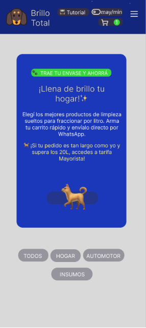
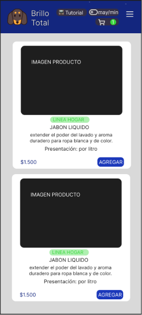
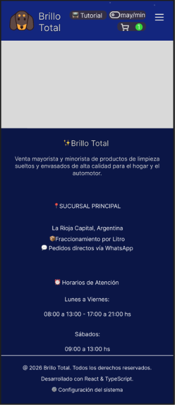
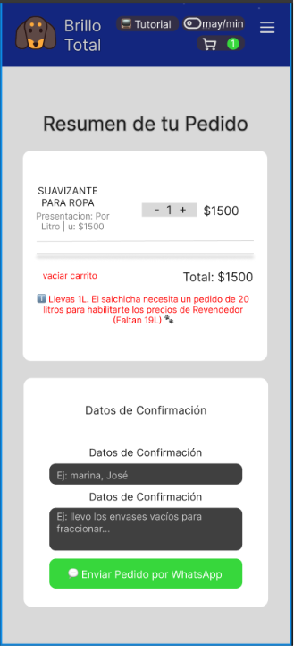
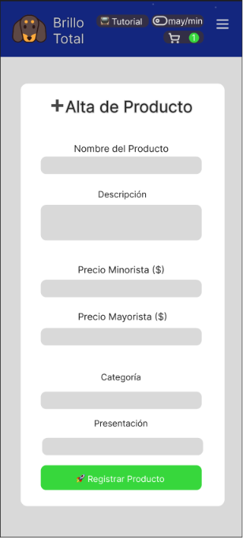
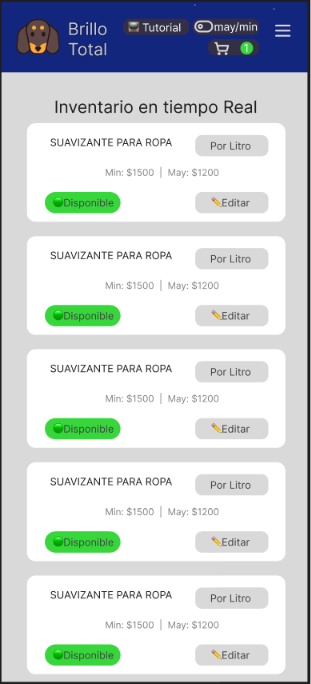

# 📂 Diseño de Interfaz: Wireframes de Baja Fidelidad

Este documento presenta los bocetos estructurales (wireframes) de las pantallas clave de la PWA de **Brillo Total**, diseñados bajo un enfoque *Mobile-First* para optimizar la experiencia de usuario en teléfonos celulares.

---

## 📐 1. Organización del Diseño Visual

El maquetado se divide en bloques semánticos estandarizados para asegurar consistencia visual en toda la navegación y adaptabilidad inmediata:

| Pantalla / Vista      | Bloques Principales Incluidos                                                                                      | Propósito en la UX                                                                                    |
| :-------------------- | :----------------------------------------------------------------------------------------------------------------- | :---------------------------------------------------------------------------------------------------- |
| **🏠 Home (Catálogo)** | `<header>` con menú y **Switch de Tarifa Global**, Banner Informativo, Buscador, Grilla de Productos por Catálogo. | Permitir el escaneo rápido de productos y previsualizar precios Minoristas/Mayoristas en tiempo real. |
| **🛒 CarritoView**     | Listado dinámico de ítems, Cantidades mutables, Desglose de totales con tarifa aplicada, Botón CTA a WhatsApp.     | Centralizar la orden y permitir al cliente auditar sus subtotales de forma clara antes del despacho.  |
| **🔐 Admin (Panel)**   | Formulario central de login por Clave Maestra, Grilla CRUD con formulario adaptado para alta/baja de artículos.    | Ofrecer al administrador una herramienta ágil para modificar precios "en caliente" desde el celular.  |

---

## 🖼️ 2. Bocetos Estructurales

*Nota: Las imágenes a continuación representan la disposición espacial de los elementos antes de la aplicación de estilos CSS definitivos.*

### A. Vista del Catálogo Público (Home)
Se prioriza el acceso directo a las categorías y la visibilidad clara del precio de los productos de limpieza por litro.

  
🔍 Haz clic aquí para ver los 3 bocetos de la Home

  #### 1. Vista Banner
  

  #### 2. Vista de los Productos
  

  #### 3. Pie de Página
  

### B. Vista del Carrito de Compras
Permite verificar la lista de compras, ajustar las cantidades de cada producto y repasar los importes calculados antes de disparar el mensaje automatizado.

  
🛒 Haz clic aquí para ver el boceto del Carrito

  #### Detalle de la Sección de Productos Seleccionados
  

### C. Vista del Panel de Administración (CRUD)
Estructura limpia basada en tarjetas independientes para gestionar el inventario, editar precios y controlar el stock de manera táctil en pantallas chicas.

  
🔐 Haz clic aquí para ver los 2 bocetos del Panel de Administración

  #### 1. Formulario para Agregar Nuevos Productos
  

  #### 2. Vista de los Productos en Tiempo Real (Módulo de Tarjetas)
  

---

## 🔗 Enlaces Internos
* 📌 Volver al [README.md](../README.md) principal.
* 📋 Ir a [01. Planificación y Requerimientos](01-planificacion.md).
* 🗺️ Ir a [02. Arquitectura de la Información](02-arquitectura-info.md).
* ⚙️ Ir a [04. Especificación del Stack Tecnológico](04-stack-tecnologico.md).
* 📈 Ir a [05. Escalabilidad y Rendimiento](05-escalabilidad.md).
* 📝 Ir a [06. Historial de Cambios (Changelog)](06-changelog.md).